# Tutorial 1 | Flexbox Containers 

## Flex & `flex-wrap` :

- Flex items will adjust automatically to how big or how small they should be based on the contents that's inside of them. 
See below image for e.g.

    

- if we add so much contents inside the flex-container they will spill out the side by default and that's annoying that's the default is `nowrap`.

    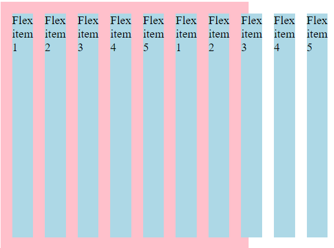

- but we can easily switch this over to `wrap` and now they'll stack one on top of each other instead of spilling out on the side. 

    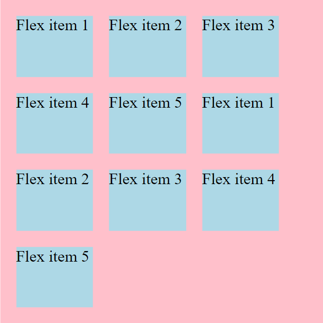

- One second thing is that with the `nowrap` they got as small as they could literally shrinking down to the smallest possible size it could to fit that text. and then when we switch over to `wrap` it's keeping the text on one line of code or one line of visual line here so we'll flex label and that's as small as it's gonna get it runs out of room and it will `wrap` that down below.

- `flex-flow` is just a shorthand for `flex-direction` & `flex wrap` so we could write `flex-row: row nowrap;` 

## `justify-content` :

- `justify-content` deals with the main-axis.

- Some values to this property and their work :

    - `flex-start` : content will be stacked from the start i.e. from left to right.

        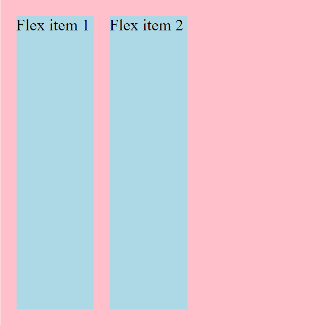

    - `flex-end` : items will be stacked from end to the start i.e. from the right to left.

        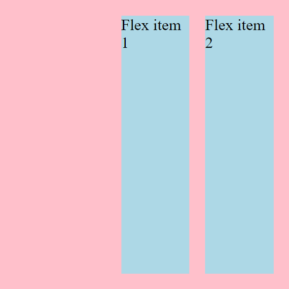

    - `center` : items will be placed to center leaving some space to both sides.

        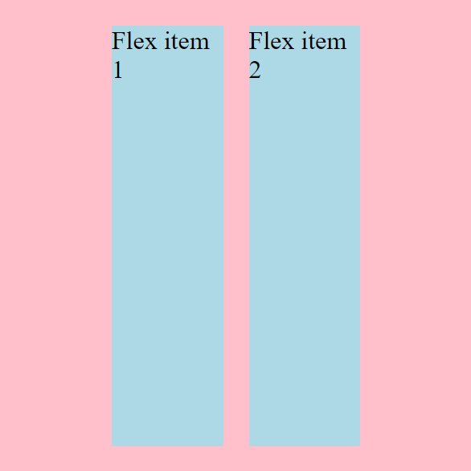

    - `space-between` : first element will stick all the way to left & last element all the way to right putting eual amount of space between them in-between.

        

    - `space-around` : `space-between` + amount of space (same as `space-between`) in the left on the first element & last element on the right.

        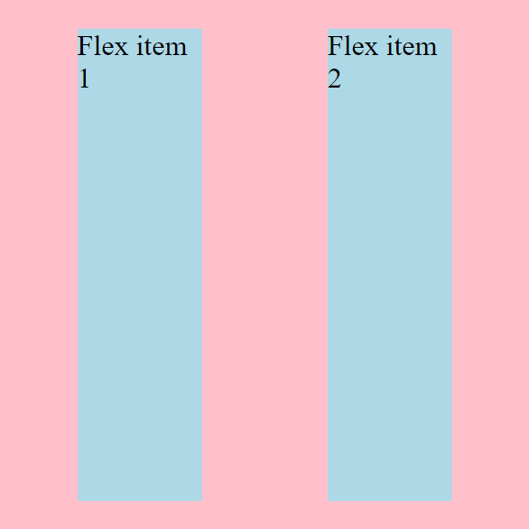

    - `space-evenly` : items distributed with equal space both inside & outside.

        

- In all the above illustrations the `flex-direction` is set to `row`.

####  What if we switch our `flex-direction` to `column` ? 

Ans. The `justify-content` will work now up & down.

All the property that applied to the items horizontally will apply now vertically. 

for e.g. Now, `justify-content: center` will vertically center the element.

Rest of the values will work same as that.

## `align-items` : 

Another one we have is `align-items` it deals with the flex-items vertically or we can say on the cross-axis. whereas`justify-content` works on the main-axis. 

#### Note : When the `flex-direction` is changed from `row` to `column` the behaviour of `justify-content` and align-items changes too. They interchange their behaviour. `justify-content` works as `align-items` whereas `align-items` works as the `justify-content`.

#### Some values to the align-items :

- `stretch` : it's the _default_ value of align-items. it makes the flex-item cover the total space vertically or on the cross axis. 

    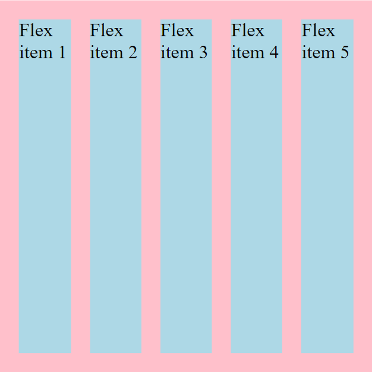

- `flex-start` : it shrinks down the flex-items to the minimum size & aligns it to the start/top. they're not gonna stretch up to fill that whole space anymore.

    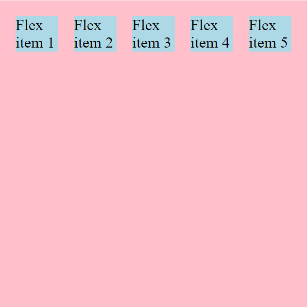

- `flex-end` : same as `flex-start` the only difference is that it aligns the items to the the end/down. it also stops the items from stretching to fill up the whole space. 

    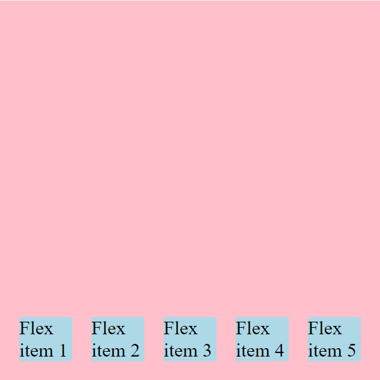

- `center` : aligns the flex-items to the center.

    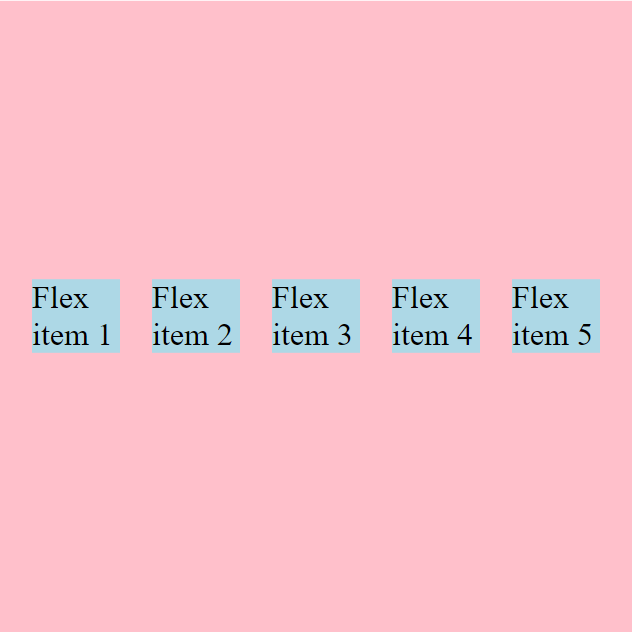

- `baseline` : it means that the first line of the text is all lining up on the same line there. The only time you see a difference with this align-items:baseline; is if there is diff. font-size involved. if everything is the same font-size this will look exactly the same as flex-start but our font-size is different so flex-start does look a little bit different.
it works really well if you had a main-content area and then a sidebar Cz you wouldn't want this happening this is one of those really annoying things that can be happen when something starting up higher than other things.

- without `baseline` using `flex-start` :

    

- using `baseline` instead of `flex-start` :

    

Now Another thing that can be confusing is something called `align-content` and that's coz `align-content` has a sort of a mid it has the same properties as the `justify-content` they both have a content in them so i guess that makes sense so we don't have the baseline option and we do have `space-between` & `space-around`.

## `align-content` :

**Now, align-content only works if you have multiple lines of content** right now it's not gonna do anything and it also conflicts with align-items. 

#### Difference b/w align-items & align-content : 

`align-items` aligns the each item in a line. whereas the `align-content` aligns the whole content. 

See below images to understand the diff. :

- `align-items: center;` :

    

    you can clearly see that the items in each row has aligned to center w.r.t the line.

- `align-content: center` :

    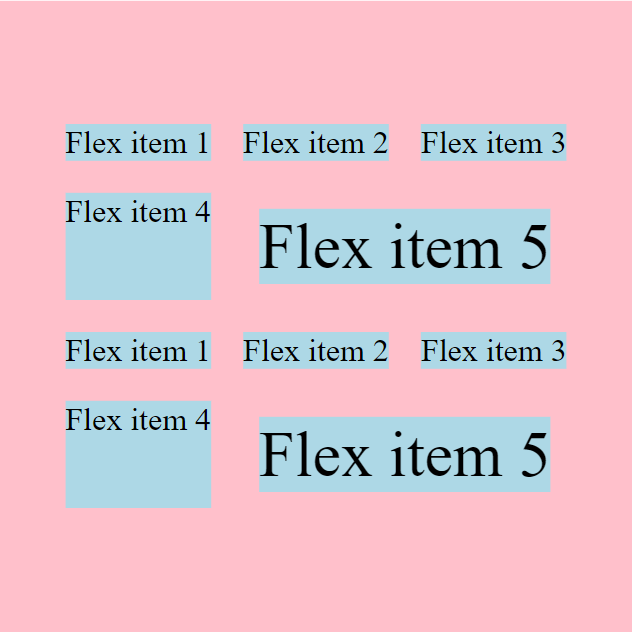

    But here, the whole content is aligned verticall to the center. 